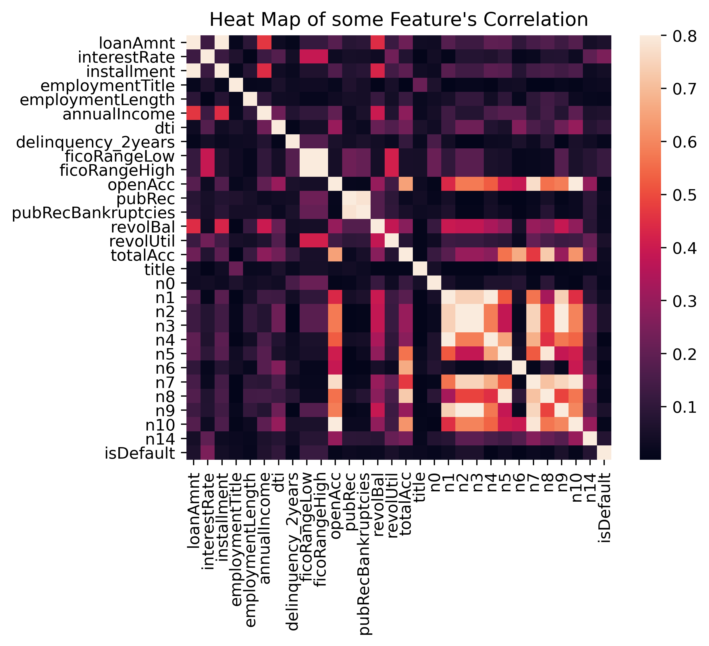
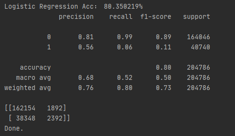
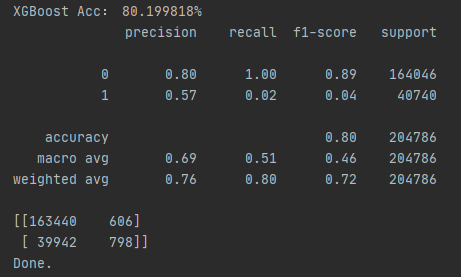
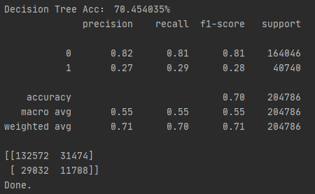
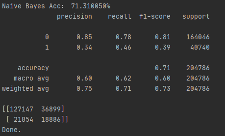

# 贷款违约预测
> 本项目是基于国内知名机器学习竞赛网站TIANCHI（天池）上的入门项目“贷款违约预测”所搭建的机器学习模型，本模型将根据用户的相关信息推断该用户违约的概率。    
> 相关信息详见：https://tianchi.aliyun.com/competition/entrance/531830/introduction    
---

## 官方文件
> sample_submit.csv - 提交样例，需要提交至官方进行测试的文件模板    
> testA.csv - 测试集，用于测试模型    
> train.csv - 训练集，用于训练模型    
---

## 数据集
> 数据源自某信贷平台的贷款记录，训练集包含用户样本数据共计80万条，测试集A内含用户信息20万条，最终提交时需要根据测试集A中的用户信息提供每位用户的贷款违约概率。训练集中每个用户样本数据共包含47个字段，具体如下表所示。    
>    
> **字段表**    
> | Field | Description |    
> | - | - |    
> | id | 为贷款清单分配的唯一信用证标识 |    
> | loanAmnt | 贷款金额 |    
> | term | 贷款期限（year） |    
> | interestRate | 贷款利率 |    
> | installment | 分期付款金额 |    
> | grade | 贷款等级 |    
> | subGrade | 贷款等级之子级 |    
> | employmentTitle | 就业职称 |    
> | employmentLength | 就业年限（年） |    
> | homeOwnership | 借款人在登记时提供的房屋所有权状况 |    
> | annualIncome | 年收入 |    
> | verificationStatus | 验证状态 |    
> | issueDate | 贷款发放的月份 |    
> | purpose | 借款人在贷款申请时的贷款用途类别 |    
> | postCode | 借款人在贷款申请中提供的邮政编码的前3位数字 |    
> | regionCode | 地区编码 |    
> | dti | 债务收入比 |    
> | delinquency_2years | 借款人过去2年信用档案中逾期30天以上的违约事件数 |    
> | ficoRangeLow | 借款人在贷款发放时的fico所属的下限范围 |    
> | ficoRangeHigh | 借款人在贷款发放时的fico所属的上限范围 |    
> | openAcc | 借款人信用档案中未结信用额度的数量 |    
> | pubRec | 贬损公共记录的数量 |    
> | pubRecBankruptcies | 公开记录清除的数量 |    
> | revolBal | 信贷周转余额合计 |    
> | revolUtil | 循环额度利用率，或借款人使用的相对于所有可用循环信贷的信贷金额 |    
> | totalAcc | 借款人信用档案中当前的信用额度总数 |    
> | initialListStatus | 贷款的初始列表状态 |    
> | applicationType | 表明贷款是个人申请还是与两个共同借款人的联合申请 |    
> | earliesCreditLine | 借款人最早报告的信用额度开立的月份 |    
> | title | 借款人提供的贷款名称 |    
> | policyCode | 公开可用的策略_代码=1新产品不公开可用的策略_代码=2 |    
> | n系列匿名特征 | 匿名特征n0-n14，为一些贷款人行为计数特征的处理 |    
>    
> 其中部分字段出于用户隐私考虑已进行脱敏处理，“isDefault”字段为用户违约结果，1表示发生违约0表示未发生。    
> 经统计，在train.csv文件的80万条用户记录样本中，有部分记录的部分字段数据为空，详细情况如下表统计。    
>    
> | # | Column | Null Count | Dtype |    
> | - | - | - | - |    
> | 7 | employmentTitle | 1 | float64 |    
> | 8 | employmentLength | 46799 | object |    
> | 15 | postCode | 1 | float64 |    
> | 17 | dti | 239 | float64 |    
> | 23 | pubRecBankruptcies | 405 | float64 |    
> | 25 | revolUtil | 531 | float64 |    
> | 30 | title | 1 | float64 |    
> | 32 | n0 | 40270 | float64 |    
> | 33 | n1 | 40270 | float64 |    
> | 34 | n2 | 40270 | float64 |    
> | 35 | n3 | 40270 | float64 |    
> | 36 | n4 | 33239 | float64 |    
> | 37 | n5 | 40270 | float64 |    
> | 38 | n6 | 40270 | float64 |    
> | 39 | n7 | 40270 | float64 |    
> | 40 | n8 | 40271 | float64 |    
> | 41 | n9 | 40270 | float64 |    
> | 42 | n10 | 33239 | float64 |    
> | 43 | n11 | 69752 | float64 |    
> | 44 | n12 | 40270 | float64 |    
> | 45 | n13 | 40270 | float64 |    
> | 46 | n14 | 40270 | float64 |    
>    
> 在原始数据集中存在大量的空值项，为了尽可能利用所有数据以得到更为真实准确的模型，根据不同数据类型决定采取不同的填充策略以保留尽可能多的原始数据。原始数据集中的特征集中为两大类，即标签类和数值类，其中前者仅用作区分不同类别而其具体值并没有数学意义，后者用于表示某一特征的量值是具备数学意义的；为此我们将对标签类特征采取众数填充的方式，数值类特征将采取中位数填充的方式，由此尽可能真实的去配合原始分布进行填充。    
> 原始数据集中的样本数量存在一定程度偏移，其中予以放贷的样本约占总体的八成，不予放贷的样本约占总体的两成，针对该情况，除了需要对样本数据进行常规的预处理以及标准化和归一化等操作，可能需要进行下采样避免模型过拟合。
---

## 数据预处理
> 由于原始数据集的样本总量较大且涉及特征较多，需要对样本数据进行较为繁琐的预处理工作以明确最终用于模型训练的输入特征和样本，抛弃异常数据样本和多余的特征以避免模型过拟合。样本特征包括标签类和数值类两大类，根据特征代表实际含义可得到如下表格：    
> | 特征类型 | 特征名称 |    
> | --- | --- |    
> | 标签量 | id, term, grade, subGrade, employmentTitle, homeOwnership, verificationStatus, purpose, initialListStatus, applicationType, title, policyCode |    
> | 数值量 | loanAmnt, interestRate, installment, employmentLength, annualIncome, issueDate, postCode, regionCode, dti, delinquency_2years, ficoRangeLow, ficoRangeHigh, openAcc, pubRec, pubRecBankruptcies, revolBal, revolUtil, totalAcc, earliesCreditLine, n系列匿名特征 |    
> 其中“id”为无关变量需要优先从数据集中剔除该特征影响，另外“employmentLength”“issueDate”“earliesCreditLine”等特征采用的是时间格式记录，为了便于计算需要对其进行转化。经过初步筛选优先将以下特征从样本中剔除：    
> | 特征名称 | 原因 |    
> | --- | --- |    
> | id | 赋予用户的随机编码，无关变量 |    
> | grade | 用户贷款等级，可由子等级得知，冗余信息 |    
> | issueDate | 贷款发放时间，弱相关混淆信息 |    
> | earliesCreditLine | 信用报告最早年份，弱相关混淆信息 |    
> | policyCode | 策略代码，所有样本均为唯一值，无用信息 |    
> | postCode | 邮编前三位，可能重复且地区信息可由地区编码得知，冗余信息 |    
> | applicationType | 申请类型，数据偏倚程度过大，混淆信息 |    
> | n11, n12, n13 | n系列特征，数据偏倚程度过大，混淆信息 |    
> 删除以上字段之后，对其余信息根据统计学$3\sigma$原则进行异常数据统计和筛选，详细结果记录在项目根目录下的clean.txt文件中。数据清洗结果表明，保留的特征中正负样本的比例基本持平，异常数据在所有样本中的占比较少，根据$3\sigma$原则剔除其余不符合相应条件的异常样本，最终保留的样本数量约占原始总量的九成，能够在很大程度上保留原始总体的主要分布特征。    
> 经数据清洗后保留下的样本数据即可作为用于训练的数据集，根据特征类型不同对标签类特征进行one-hot处理，对数值类特征进行标准化和归一化处理，并将处理后的数据集按比例随机抽样为训练集和测试集。    
---

## 模型训练
> 训练模型前为了进一步确定输入的特征变量，首先针对保留的各特征变量绘制了相关性系数热力图，相关性系数取绝对值，具体如下    
>     
> 由相关性系数热力图可以得知，部分特征变量间存在强相关关系（corr>0.7），对于这类变量拟采取“保留部分，剔除冗余”的方式进行处理，以此压缩训练时需要输入的变量减少训练参数，同时也可以有效避免过拟合启动情况发生，从而提高模型的泛化能力。    
> 分别采用逻辑回归（LR）、XGBoost、K最邻近（kNN）、决策树（DT）、朴素贝叶斯（NB）等算法训练预测模型，其中除了kNN算法由于样本数量及特征个数相对较多训练时间过长而放弃使用，其余算法均能在较短时间内得到结果。各模型具体性能指标可参考sklearn自带的分类报告及混淆矩阵，如下所示    
> ### LR    
>      
> ### XGBoost    
>      
> ### DT    
>      
> ### NB    
>      
> 本赛季正式赛最终提交日之前提交的推断版本为由XGBoost训练的模型，获得成绩为0.5231(669 / 3634)，根据上述性能对比，如果使用NB训练的模型进行推断可能会获得更好的效果。    
